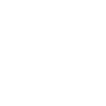

# Onion Generator

 

## Usage

`python3 OnionGenerator.py`

Will produce two output images using the text contained in the input text file.
The image width and height will be sqrt(number of characters in text file) up to a maximum of 12000x12000.

## Dependencies

[OpenCv2](https://pypi.org/project/opencv-python/)

Install with `pip install opencv-python`

## Configuration

Inside OnionGenerator.py you can change the input and output paths:

`OnionFolderPath` and `NormalFolderPath` should point to the folders that contain the image files of a-z and the space character. These images must all have the same size e.g. 8x8, 16x16, etc.

`InputTextFilePath` should point to the desired text file to have be converted into an image.

`OnionOutputFilePath` and `NormalOutputFilePath` should point to the desired folder and output file name for each image.

## Credits

"Normal" font: [alkhemikal](https://fontenddev.com/fonts/alkhemikal/) by Font End Dev.

"Onion" font: from [ZeroRanger](https://se-made.com/zeroranger.html) by System Erasure.